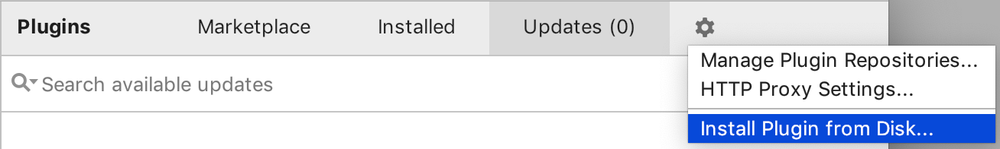

[](http://github.com/badges/stability-badges)


# Google Container Tools for IntelliJ

This plugin adds support for [Kubernetes](https://www.kubernetes.io) development into the [JetBrains family of IDEs](https://www.jetbrains.com/products.html), including IntelliJ (both Community and Ultimate editions), GoLand, PyCharm, WebStorm (and others).

**Note**: This plugin is still in development.

## Features

* One click deployment to Kubernetes clusters right from your IDE using [Skaffold](https://skaffold.dev/docs/getting-started/). Configure Skaffold to use your desired build and deployment strategies: works with kubectl, Helm, Google Cloud Build (for remote builds), Jib and Kanico.
* Continuous development on Kubernetes. Watches the dependencies of your docker image or Jib Java project for changes, so that on any change, Skaffold builds and deploys your application to a Kubernetes cluster.
* Automatic discovery and support for project with existing Skaffold configuration, in any language supported by your preferred JetBrains IDE.
* Initial support for Skaffold configuration file editing and smart templates.

## Prerequisites and required dependencies

This plugin uses familiar Kubernetes and container tools to bring you a rich Kubernetes experience in IntelliJ and other JetBrains IDEs. At the minimum, the following tools are expected to be installed and setup on your system and available in the system path:

* [kubectl](https://kubernetes.io/docs/tasks/tools/install-kubectl/) for working with Kubernetes clusters and managing Kubernetes deployments.
* [Skaffold](https://skaffold.dev/docs/getting-started/) to support continuous development on a Kubernetes cluster, smart image building and tagging, and an array of supported deployment and build types.
* [Docker](https://www.docker.com/) for building and pushing your container images. *Note*: Docker is optional if you are using [Jib to build your container images](https://github.com/GoogleContainerTools/jib).
* Configured Kubernetes cluster. It could be a cluster for local development, such as [Minikube](https://kubernetes.io/docs/setup/minikube/) or [Docker Kubernetes](https://docs.docker.com/docker-for-mac/kubernetes/) cluster, or remote cluster, such as [Google Kubernetes Engine](https://cloud.google.com/kubernetes-engine/) cluster. We recommend [Minikube](https://kubernetes.io/docs/setup/minikube/) cluster for local development.

## Installing the plugin into your IDE

If you'd like to try out the plugin pre-release, you can build it from source and install it into your IDE:

1) Clone this repository to your machine:<br />
   `git clone git@github.com:GoogleContainerTools/google-container-tools-intellij.git`
2) Build the plugin from the root of the repository:<br />
   `./gradlew buildPlugin`
3) Find the `.zip` binary in the root of the repository under: <br />
   `build/distributions/google-container-tools-intellij.zip`
4) Install the plugin into your JetBrains IDE:
   1) Go to `Preferences/Settings > Plugins`
   2) Select the settings gear icon and then `Install Plugin From Disk`:
       
   3) Select the zip from `step 3`

## Getting started


The plugin can work in any of the  [JetBrains family of IDEs](https://www.jetbrains.com/products.html), let’s try the first example with Kubernetes and Java in IntelliJ IDE (the plugin supports both Community and Ultimate editions). Follow the installation steps above to install the plugin. Restart your IDE if prompted to activate the plugin.

Clone the repository to your local machine to get your copy of the repository:
```
git clone https://github.com/GoogleContainerTools/google-container-tools-intellij.git
```

Open the `hello-spring-boot` example from `google-container-tools/examples` directory with your IntelliJ IDE. You can either point to the directory or to the Maven build file (`pom.xml`). The project opens and loads:


This project is a very simple web application created with [the popular Spring Boot framework](https://spring.io/projects/spring-boot).

Once the project loads, the plugin will detect it is preconfigured with Skaffold YAML configuration to build image and deploy to Kubernetes. A notification shows:


Click `Create run configurations for Kubernetes with Skaffold` link to automatically create Kubernetes deployment and continuous development IDE run targets for the project:


Now new run targets can be used to build the project and deploy it to Kubernetes or develop on Kubernetes cluster continuously. 

However, before we can deploy and develop, we need to make sure we have access to the image repository where the project image is about to be pushed. By default project is configured to use [Google Container Registry](https://cloud.google.com/container-registry/) and a development project for the plugin which you probably don’t have access to. Once you have your repository set up ([Google Container Registry](https://cloud.google.com/container-registry/), [DockerHub](https://hub.docker.com/), private repository, etc.), you can edit run targets and specify it as a *default image repository* in run target settings:


*Note*: this step is not required when you work with your own Kubernetes manifests and Skaffold configuration where you specify a repository and an image name that are accessible to you.

Now it is time to deploy the project to Kubernetes or develop on Kubernetes cluster from your IDE! Before we start, make sure [all required dependencies](dependencies) are available on your machine. Click run action for `Develop on Kubernetes` to start development cycle on your Kubernetes cluster:


The development cycle initiates and console window with the logs opens. The plugin uses Skaffold to build an image for the project, tag it, push it to the configured repository, and then uses `kubectl` to deploy the project Kubernetes manifests:


Once the build completes, the image is pushed and deployment starts, the console begins to stream logs from your Kubernetes deployment:


As you can see, Spring Boot application initializes and launches built-in web server. Be default, Spring Boot web server uses port 8080 to serve the content. The plugin and Skaffold make sure you don’t have to worry about accessing the deployment via remote addresses - all declared container ports are port-forwarded automatically!


Navigate your browser to `localhost:8080` to access the Spring Boot application running on your Kubernetes cluster. Alternatively, use `curl` command to interact with the application:


```
$ curl localhost:8080
Hello, World of Kubernetes with IntelliJ!
```

