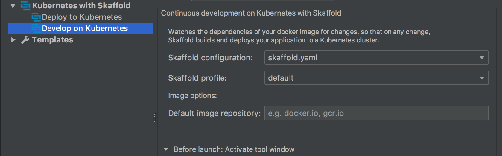

# Example

This directory contains example projects for [JetBrains family of IDEs](https://www.jetbrains.com/products.html) that demonstrate how to work with the plugin and use it to deploy and develop on Kubernetes.

*Note*: Before you can deploy and develop on Kubernetes with these projects, you need to make sure you have access to the image repository where the project image is about to be pushed. By default project is configured to use [Google Container Registry](https://cloud.google.com/container-registry/) `grc.io/gcp-dev-tools` repository which you probably don’t have access to. Once you have your own repository set up ([Google Container Registry](https://cloud.google.com/container-registry/), [DockerHub](https://hub.docker.com/), private repository, etc.), you can edit run targets and specify it as a *default image repository* in run target settings:

*Note*: this is not required when you work with your own Kubernetes manifests and Skaffold configuration where you specify a repository and an image name that are accessible to you.
